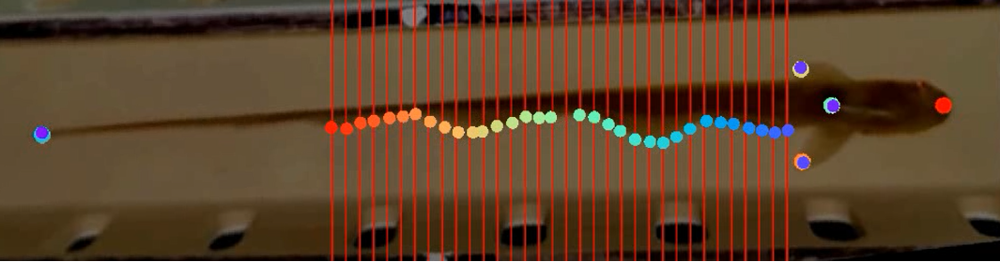
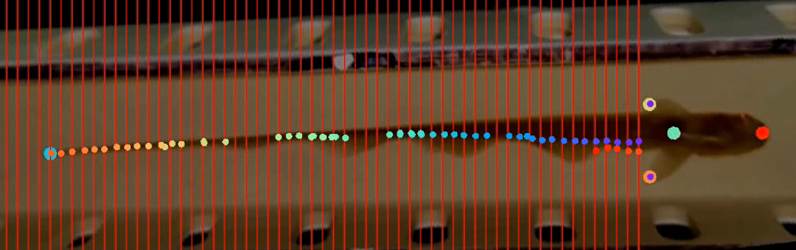

# Ribbon fin tracking of a glassknife fish 

## Requirements
- DeepLabCut version 2.2.3
- MATLAB 2021a or >

## Objective

The objective of the project is to study the motion of the undulatory ribbon-fin of a glassknife fish, Eigenmannia
virescens and track the motion efficiently. Quality data is significant in understanding the complex mechanics
of the two counter propagating waves produced by the fish, one starting from the head and the other starting
from the tail. Tracking of the fin is a challenging problem because the number of waves produced at each time
step might vary and tracking a point on the wave is not equivalent to tracking a point on the fin. This idea and
co-ordinate frame transformations were used to track the fin efficiently.

## Approach 

The start point for tracking the fin was the head tracking. Along with the head, the body center, the pectoral fins,
the tail and a point on the shuttle was tracked. Having the same coordinates for the head position makes the math easy. A reference point ideally the 2-D head position of the 1st frame was used as the reference point for all the other frames. The head position for all frames were then moved using the `videoRefFrameShift.m` file and they follow these equations:

$$\Delta x = x_{ref} - x$$
$$\Delta y = y_{ref} - y$$
$$x_{h_{ref}} = x_h + \Delta x$$
$$y_{h_{ref}} = y_h + \Delta y$$
$$\theta = tan^{-1}(\frac{y_h - y_b}{x_h - x_b})$$

Frame translation          |  Frame Rotation
:-------------------------:|:-------------------------:
 |  

Starting from a fixed distance from the head position, 56 lines were drawn perpendicular to the line joining the head and the body center to increase the accuracy of tracking. For the videos chosen, 56 lines covered all of the fin and the body of the fish. It is important to note that fixing the head at the reference position will help in drawing the lines at fixed distances from this position.

## Using the code 
- Use `convVideo2Frame.m` to extract frames from a video 
	- Input needed - a folder pointing to a video
	- Output - gives out frames and stores it in desired location
- Use `videoRefFrameShift.m` to shift the head position to a fixed reference point (in this project the head position of the first frame is the reference), 
  to orient the the angle between head and body center and to draw lines at fixed pixel points (x- coordinates) on the given set of frames.
	- Input needed - a folder containing all the frames and DataSet containing the tracked head, bodycenter data points for the frames
				(Note that the dataset should correspond to the frames being used) 
	- Output - Modified frames with appropriate oreintation and lines drawn
	- Dependencies - `rotateAround.m`
- Use `videoRefFrameShift.m` to convert frames back to a video 
	- Input needed - A folder containing frames and desired location for the video
	- Output - Video generated from these frames
- Use `Test_fin.m` to check the graphs and wave features for the Dataset
	- Input needed - Datasets (One for the fin points and the other one for the body line)
	- Output - wave features and graphs 
	- Dependencies - `makefinData_x.m`, `makefinData_y.m`, `makebodyData_x.m`, `makebodyData_x.m`, `SplineArg.m`, `GetAvg.m`

NOTE:
- Recommended order of execution: `convVideo2Frame.m` -> `videoRefFrameShift.m` -> `videoRefFrameShift.m` -> `Test_fin.m`
- All the `.mat` files that contain the data are in `data` folder and all the columns are named accordingly(fin point coordinates, head coordinates and body center coordinates)
- Make sure to load the data into your workspace/ change the file location in the code before running it
## Results
- 150 frames were extracted for each video using kmeans clustering algorithm inbuilt in DLC. 
- The cluster step chosen was 1 and GUI slider width was set to 25. 
- Resnet 50 network was used to train the labeled dataset and the augmentation method used was imgaug. 
- Maximum iterations were set to 25,000.

Fin tracking               |  Body line tracking
:-------------------------:|:-------------------------:
 |  
